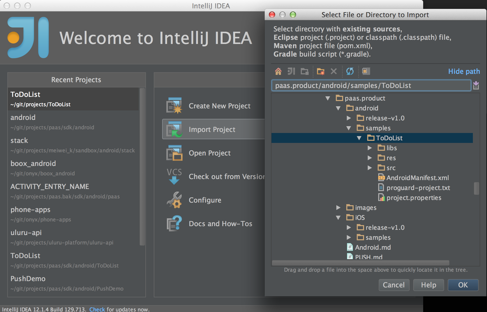
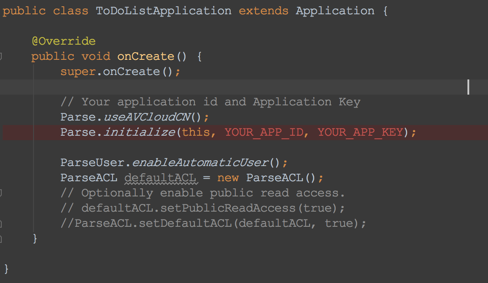

# 欢迎使用AVOS Cloud

本教程将会向您展示如何使用AVOS Cloud Android SDK开发一个简单的移动应用。

# 申请AVOS Cloud帐号

如果您还未拥有AVOS Cloud的帐号，请访问cn.avoscloud.com （中国区）或者us.avoscloud.com（美国区）申请开发人员帐号。

请注意，目前中国区和美国区的数据并不能互通。 


# 创建基于AVOS Cloud的移动App


# 查看app keys


app keys将会在您的代码中使用到，同时请注意保管好您的app keys，以免给您的应用带来损失。

# 下载SDK

```
git clone git@github.com:avos/paas.product.git
```


# 打开示例工程

### 使用IntelliJ Idea导入





### 修改AppKey和AppId




