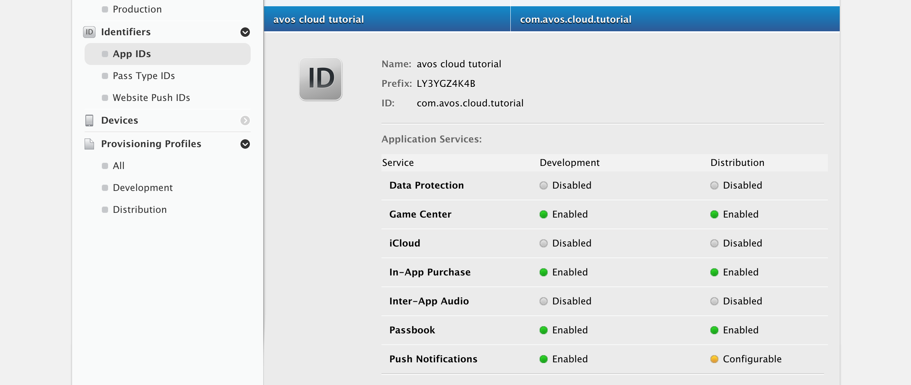
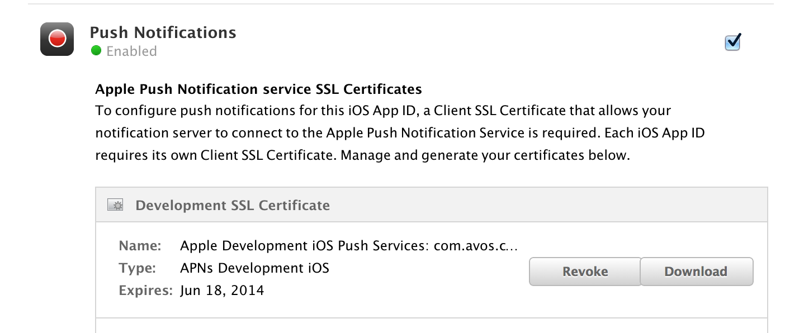
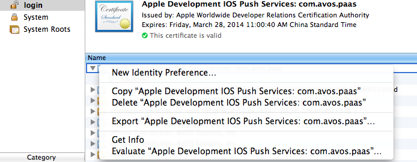
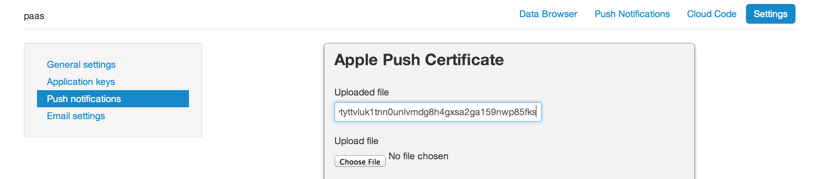
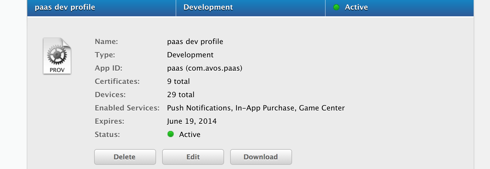

# 如何使用 AVOS  Cloud 的 Push 功能

本文将向您简单介绍如何使用 AVOS Cloud 的推送功能。


## 登录到 Apple 的 Developer Program Portal

https://developer.apple.com/account/ios/certificate/certificateList.action


创建您的 App ID，并且选择允许 push。并且确保您的 App ID 不含有通配符



## 允许 App 的 Push 功能



## 导出您的 Push 证书并且保存为 `.p12` 格式 



**请注意确保您的证书在导出时不带有密码保护**

## 将 `.p12` 文件上传到 AVOS Cloud



## 使用您的 App ID 生成对应的 Provision Profile



## 添加 Push 相关的代码

```objc
- (BOOL)application:(UIApplication *)application didFinishLaunchingWithOptions:(NSDictionary *)launchOptions {
    [[UIApplication sharedApplication] registerForRemoteNotificationTypes:
     (UIRemoteNotificationTypeSound | UIRemoteNotificationTypeAlert)];
    return YES;
}

- (void)application:(UIApplication *)app didRegisterForRemoteNotificationsWithDeviceToken:(NSData *)deviceToken {
    AVInstallation *currentInstallation = [AVInstallation currentInstallation];
    [currentInstallation setDeviceTokenFromData:deviceToken];
    [currentInstallation saveInBackground];
}

- (void)application:(UIApplication *)app didFailToRegisterForRemoteNotificationsWithError:(NSError *)err {
    
    NSString *str = [NSString stringWithFormat: @"Error: %@", err];
    NSLog(@"Error %@", str);
}

-(void)application:(UIApplication *)application didReceiveRemoteNotification:(NSDictionary *)userInfo
{
    NSLog(@"recevied %@", userInfo);
}

```

