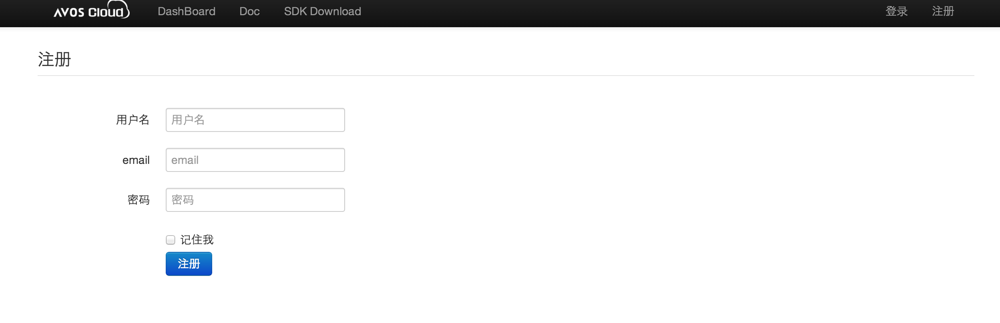
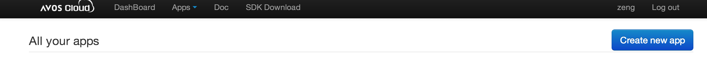
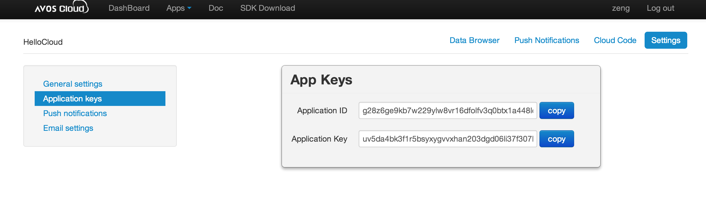
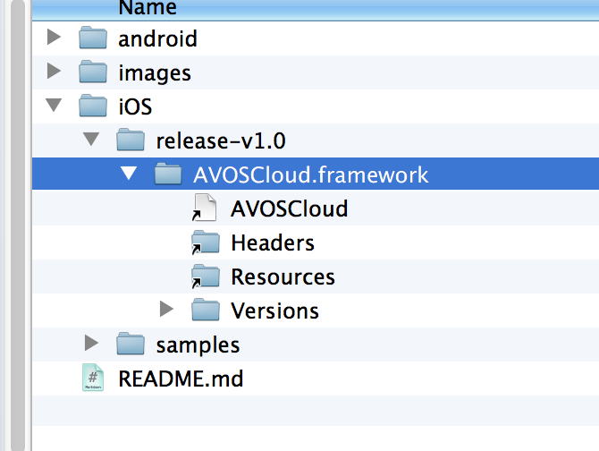
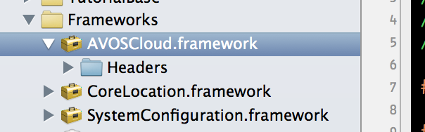
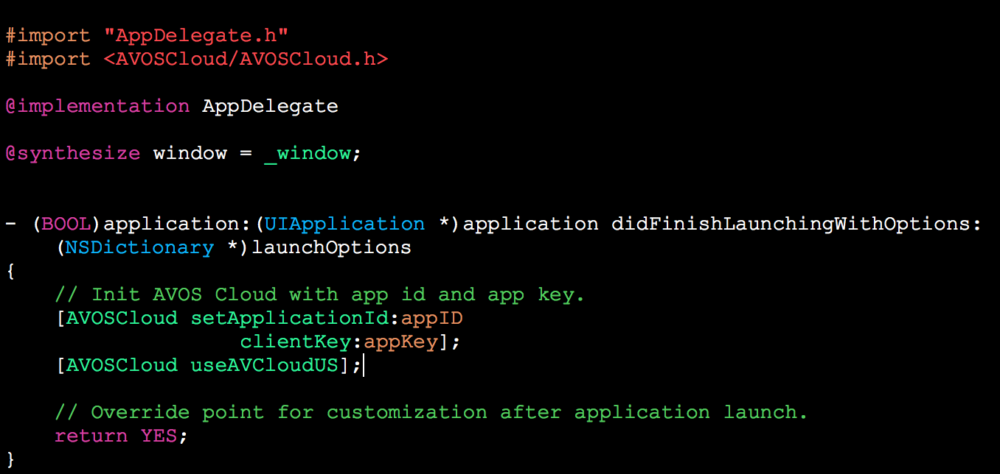
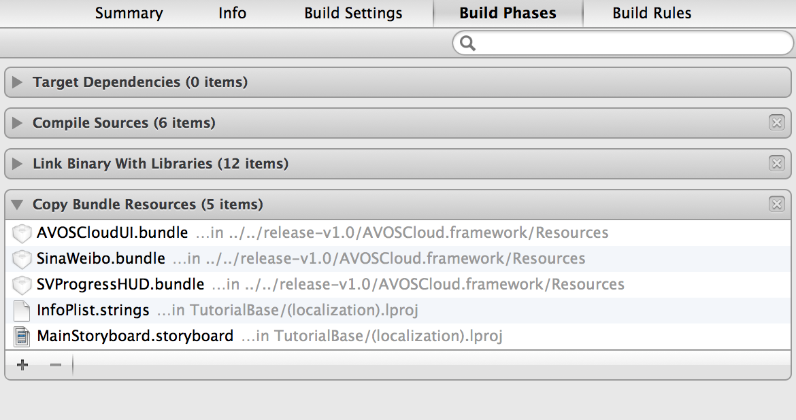

# 欢迎使用AVOS Cloud

本教程将会向您展示如何使用AVOS Cloud SDK开发一个简单的图片应用。

# 申请AVOS Cloud帐号

如果您还未拥有AVOS Cloud的帐号，请访问cn.avoscloud.com （中国区）或者us.avoscloud.com（美国区）申请开发人员帐号。

请注意，目前中国区和美国区的数据并不能互通。 





# 创建基于AVOS Cloud的移动App




# 查看app keys



app keys将会在您的代码中使用到，同时请注意保管好您的app keys，以免给您的应用带来损失。

# 下载SDK

```
git clone git@github.com:avos/avoscloud-sdk.git
```

# 使用CocoaPods

您也可以使用CocoaPods添加项目的依赖

````
platform :ios, '5.0'
pod 'AVOSCloud'
pod 'AVOSCloudUI
````

# 创建iOS工程


# 将AVOS Cloud SDK加入到工程中

### 使用Finder打开sdk所在的位置，如下图所示




### 将SDK加入到project中，如下图所示



# 初始化AVOS Cloud SDK

## 引用头文件

```objc
#import "AppDelegate.h"
#import <AVOSCloud/AVOSCloud.h>
```

## 初始化Keys

```objc
@implementation AppDelegate

- (BOOL)application:(UIApplication *)application didFinishLaunchingWithOptions:(NSDictionary *)launchOptions
{
    // Init AVOS Cloud with app id and app key.
    [AVOSCloud setApplicationId:appID
                   clientKey:appKey];
    [AVOSCloud useAVCloudUS];
    
    // Override point for customization after application launch.
    return YES;
}

```





# 增加LoginViewController

```objc
-(IBAction)logInPressed:(id)sender
{
    [AVUser logInWithUsernameInBackground:self.userTextField.text password:self.passwordTextField.text block:^(AVUser *user, NSError *error) {
        if (user) {
            //Open the wall
             [self performSegueWithIdentifier:@"LoginSuccesful" sender:self];
        } else {
            //Something bad has ocurred
            NSString *errorString = [[error userInfo] objectForKey:@"error"];
            UIAlertView *errorAlertView = [[UIAlertView alloc] initWithTitle:@"Error" message:errorString delegate:nil cancelButtonTitle:@"Ok" otherButtonTitles:nil, nil];
            [errorAlertView show];
        }
    }];
}
```

# 增加RegisterViewController

```objc

////Sign Up Button pressed
-(IBAction)signUpUserPressed:(id)sender
{
    AVUser *user = [AVUser user];
    user.username = self.userRegisterTextField.text;
    user.password = self.passwordRegisterTextField.text;
    
    [user signUpInBackgroundWithBlock:^(BOOL succeeded, NSError *error) {
        if (!error) {
            //The registration was succesful, go to the wall
            [self performSegueWithIdentifier:@"SignupSuccesful" sender:self];
            
        } else {
            //Something bad has ocurred
            NSString *errorString = [[error userInfo] objectForKey:@"error"];
            UIAlertView *errorAlertView = [[UIAlertView alloc] initWithTitle:@"Error" message:errorString delegate:nil cancelButtonTitle:@"Ok" otherButtonTitles:nil, nil];
            [errorAlertView show];
        }
    }];
}
```

# 创建UploadImageViewController

```objc

-(IBAction)sendPressed:(id)sender
{
    [self.commentTextField resignFirstResponder];
    
    //Disable the send button until we are ready
    self.navigationItem.rightBarButtonItem.enabled = NO;
    
    //Place the loading spinner
    UIActivityIndicatorView *loadingSpinner = [[UIActivityIndicatorView alloc] initWithActivityIndicatorStyle:UIActivityIndicatorViewStyleWhiteLarge];
    
    [loadingSpinner setCenter:CGPointMake(self.view.frame.size.width/2.0, self.view.frame.size.height/2.0)];
    [loadingSpinner startAnimating];
    [self.view addSubview:loadingSpinner];
    
    //Upload a new picture
    NSData *pictureData = UIImagePNGRepresentation(self.imgToUpload.image);
    
    AVFile *file = [AVFile fileWithName:@"img" data:pictureData];
    [file saveInBackgroundWithBlock:^(BOOL succeeded, NSError *error) {
        
        if (succeeded){
            
            //Add the image to the object, and add the comments, the user, and the geolocation (fake)
            AVObject *imageObject = [AVObject objectWithClassName:WALL_OBJECT];
            [imageObject setObject:file forKey:KEY_IMAGE];
            [imageObject setObject:[PFUser currentUser].username forKey:KEY_USER];
            [imageObject setObject:self.commentTextField.text forKey:KEY_COMMENT];
            
            AVGeoPoint *point = [AVGeoPoint geoPointWithLatitude:52 longitude:-4];
            [imageObject setObject:point forKey:KEY_GEOLOC];
            
            [imageObject saveInBackgroundWithBlock:^(BOOL succeeded, NSError *error) {
                
                if (succeeded){
                    //Go back to the wall
                    [self.navigationController popViewControllerAnimated:YES];
                }
                else{
                    NSString *errorString = [[error userInfo] objectForKey:@"error"];
                    [self showErrorView:errorString];
                }
            }];
        }
        else{
            NSString *errorString = [[error userInfo] objectForKey:@"error"];
            [self showErrorView:errorString];
        }
        
        [loadingSpinner stopAnimating];
        [loadingSpinner removeFromSuperview];       
        
    } progressBlock:^(int percentDone) {
        
    }];
}
```

# 创建ImagesViewController

## 获取所有的图片列表

```objc
//Get the list of images
-(void)getWallImages
{
    //Prepare the query to get all the images in descending order
    AVQuery *query = [AVQuery queryWithClassName:WALL_OBJECT];
    [query orderByDescending:KEY_CREATION_DATE];
    [query findObjectsInBackgroundWithBlock:^(NSArray *objects, NSError *error) {
        
        if (!error) {
            //Everything was correct, put the new objects and load the wall
            self.wallObjectsArray = nil;
            self.wallObjectsArray = [[NSArray alloc] initWithArray:objects];
            
            [self loadWallViews];
            
        } else {
            //Remove the activity indicator
            [self.activityIndicator stopAnimating];
            [self.activityIndicator removeFromSuperview];
            
            //Show the error
            NSString *errorString = [[error userInfo] objectForKey:@"error"];
            [self showErrorView:errorString];
        }
    }];

}
```

## 加载图片

```objc
-(void)loadWallViews
{
    //Clean the scroll view
    for (id viewToRemove in [self.wallScroll subviews]){
        
        if ([viewToRemove isMemberOfClass:[UIView class]])
            [viewToRemove removeFromSuperview];
    }
    
    
    //For every wall element, put a view in the scroll
    int originY = 10;
    
    for (AVObject *wallObject in self.wallObjectsArray){
        
        
        //Build the view with the image and the comments
        UIView *wallImageView = [[UIView alloc] initWithFrame:CGRectMake(10, originY, self.view.frame.size.width - 20 , 300)];
        
        //Add the image
        AVFile *image = (PFFile *)[wallObject objectForKey:KEY_IMAGE];
        UIImageView *userImage = [[UIImageView alloc] initWithImage:[UIImage imageWithData:image.getData]];
        userImage.frame = CGRectMake(0, 0, wallImageView.frame.size.width, 200);
        [wallImageView addSubview:userImage];
        
        //Add the info label (User and creation date)
        NSDate *creationDate = wallObject.createdAt;
        NSDateFormatter *df = [[NSDateFormatter alloc] init];
        [df setDateFormat:@"HH:mm dd/MM yyyy"];
        
        UILabel *infoLabel = [[UILabel alloc] initWithFrame:CGRectMake(0, 210, wallImageView.frame.size.width,15)];
        infoLabel.text = [NSString stringWithFormat:@"Uploaded by: %@, %@", [wallObject objectForKey:KEY_USER], [df stringFromDate:creationDate]];
        infoLabel.font = [UIFont fontWithName:@"Arial-ItalicMT" size:9];
        infoLabel.textColor = [UIColor whiteColor];
        infoLabel.backgroundColor = [UIColor clearColor];
        [wallImageView addSubview:infoLabel];
        
        //Add the comment
        UILabel *commentLabel = [[UILabel alloc] initWithFrame:CGRectMake(0, 240, wallImageView.frame.size.width, 15)];
        commentLabel.text = [wallObject objectForKey:KEY_COMMENT];
        commentLabel.font = [UIFont fontWithName:@"ArialMT" size:13];
        commentLabel.textColor = [UIColor whiteColor];
        commentLabel.backgroundColor = [UIColor clearColor];
        [wallImageView addSubview:commentLabel];
        
        [self.wallScroll addSubview:wallImageView];
        
        
        originY = originY + wallImageView.frame.size.width + 20;
        
    }
    
    //Set the bounds of the scroll
    self.wallScroll.contentSize = CGSizeMake(self.wallScroll.frame.size.width, originY);
    
    //Remove the activity indicator
    [self.activityIndicator stopAnimating];
    [self.activityIndicator removeFromSuperview];
}
```

# 手工添加bundle

为了可以在设备上正常运行app，您需要手工copy bundle



# 下载完整示例

```
git clone git@github.com:avos/avoscloud-sdk.git
cd avoscloud-sdk.git/iOS/samples
```
