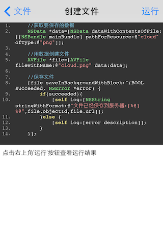

# AVOSCloud iOS Demo
###### 这个项目是为了帮助使用AVOSCloud的开发者, 尽快的熟悉和使用SDK而建立的, 包含了各种基础和高级用法.

## 安装Frameworks

### * 自动安装

Demo采用`cocoapods`安装AVOSCloud的相关Frameworks, 方法非常简单, 用终端在本文件夹执行代码:

	pod install
	
不出问题的话 1分钟即可完成所有设置, 并在文件夹中生成文件名为`AVOSDemo.xcworkspace` 打开这个文件,就可以运行Demo了

### * 手动安装

请参考 https://cn.avoscloud.com/start.html

----

## 使用说明

### * 查看源码
您可以在Xcode中看到本项目的所有代码. 也可以在App运行和操作中更直观的查看.

1. 每一例子列表右上角都有`查看源码`的按钮, 可以直接查看本组例子的源码. 
2. 每一个例子运行界面也会直接显示当前列子的代码片段.  

### * 添加Demo

1. 新建一个继承`Demo`的类, 文件位置在项目的`AVOSDemo`文件夹
2. 在.m里的`@end`前加一句`MakeSourcePath` 用来在编译时生成返回这个文件的方法
3. 加一个demo方法. 方法必须以demo开头, 且必须是严格按照骆驼命名法, 否则方法名现实可能会有问题

----
## 其他

如果您在使用AVOSCloud SDK中, 有自己独特高效的用法, 非常欢迎您fork 并提交pull request, 帮助其他开发者更好的使用SDK. 我们将在本项目的贡献者中, 加入您的名字和联系方式(如果您同意的话)
